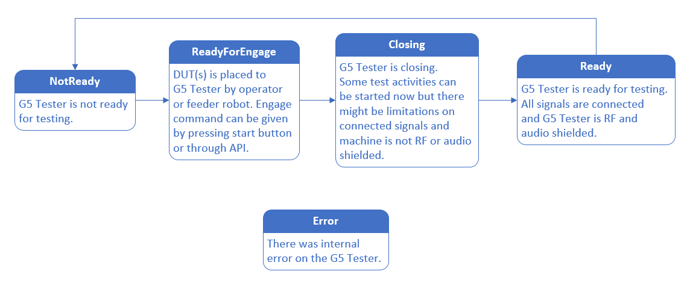

# G5-Test-Sequencer-Docs
Documentation and examples for G5 Test Sequencer development

## G5 States

G5 tester has rather complex internal state machine that controls the behavior of the G5 tester. This ensures that everything is initialized on startup and so on. Luckily you don't need to care about the internal state machine. Instead you need to know when G5 tester is ready for testing. For that you just make GET request to URL/api. Returned json contains properties field that contains state field.

States are:

Client software must check whether G5 Tester is ready for testing. Testing can be started already when G5 Tester is closing but there is some limitation for tests. Limitations depends on your HW setup but at least there is no RF, audio or other shielding. When testing is ready client software must send release command.

See example program for handling states and sending release command.

